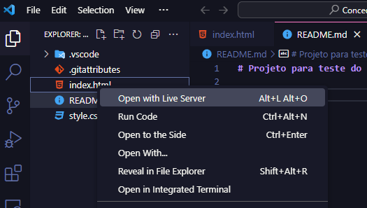
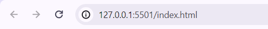

# Gerenciando proposta de emprestimo de uma API com Celery e RabbitMQ

## 📖  Descrição

API recebe os dados da proposta salva no banco de dados e encaminha a proposta para uma fila do RabbitMQ onde celery coleta e avalia a proposta atribuindo "APROVADO" ou "NEGADO"

<br/>

## 🛠️ Funcionalidades

- Recebe dados da proposta e salva no banco de dados.
- A proposta vai para fila RabbitMQ e aguarda celery.
- O celery avalia proposta e defini status para "APROVADO" ou "NEGADO"


## 📡 Tecnologias utilizadas 
<div align="center"> 


</div>


<br/>


## ⏳ Inicialização

- Para garantir uma experiência de instalação sem complicações, a aplicação está totalmente contida em um ambiente Docker. Siga estas etapas simples:

- Passo 1: Clone o repositório usando o comando: ``` git clone https://github.com/Jdalarmi/Emprestimo_With_Celery_RabbitMQ.git```

- Passo 2: Após acessar o projeto, construa o container com as dependências utilizando: ``` docker-compose build``` aguarde.....

- Passo 3: Agora, suba o ambiente Docker contendo RabbitMQ, Celery e Django executando:```docker-compose up```.

- Nota: Certifique-se de aguardar pelo menos 60 segundos para garantir que Celery seja iniciado corretamente após RabbitMQ e Django.

- Agora, seu ambiente está pronto! Navegue até a aplicação em seu navegador e comece a usá-la.

# Testando com HTML PAGE:
- Para fins de teste com formulario HTML siga os passos abaixo:
- Passo 1: Abra um novo terminal e execute ```git clone https://github.com/Jdalarmi/Concede_Emprestimo.git```

- Passo 2: Execute o comando ```code .```

- Passo 3: Com Vscode aberto na pasta procure pelo index.html pressione botão direito e selecione Open with Live Server


- Passo 4: Verifique no seu navegador qual porta esta rodando o django esta configurado para receber requisições da porta "http://127.0.0.1:5501"



- Nota: caso sua porta esteja em um faixa de IP diferente será necessario configurar na pasta core/setings : CORS_ALLOWED_ORIGINS = [
    "http://127.0.0.1:5501", 
], com porta que esta no seu navegador.

<br/>


<br/>

## 🔎 Status do Projeto


<br/>


